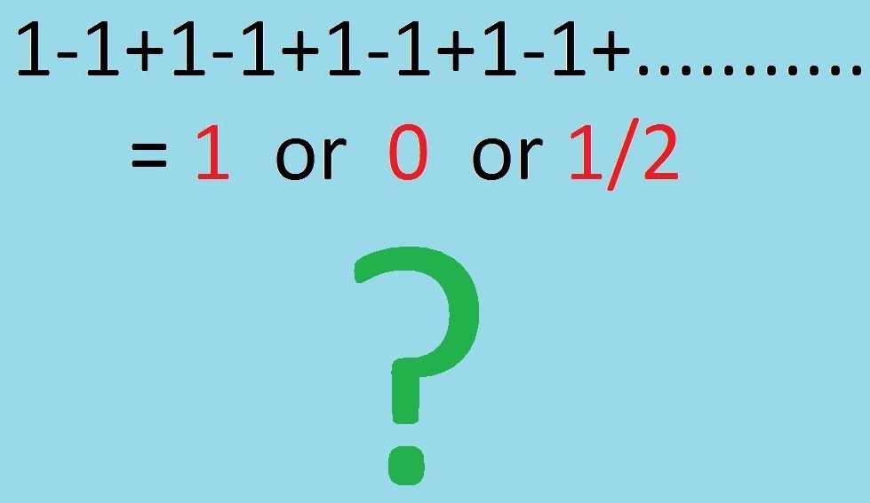
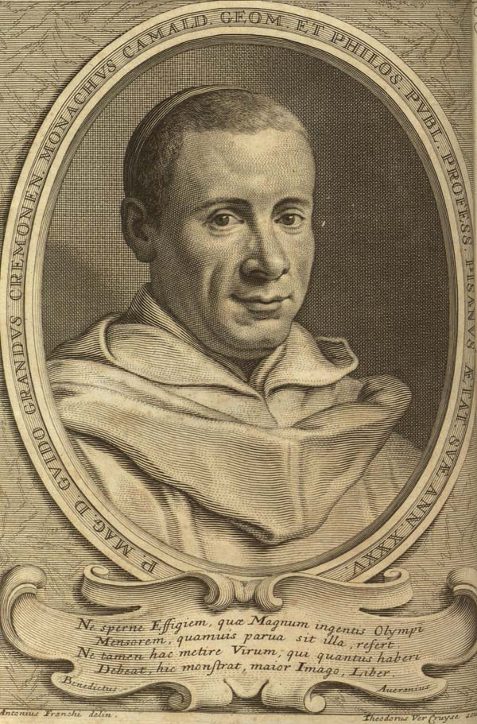
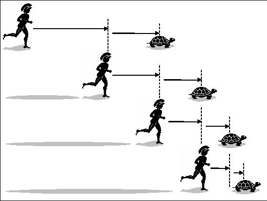
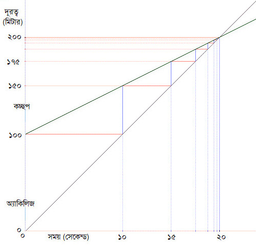
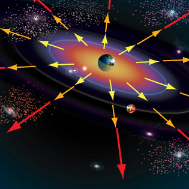
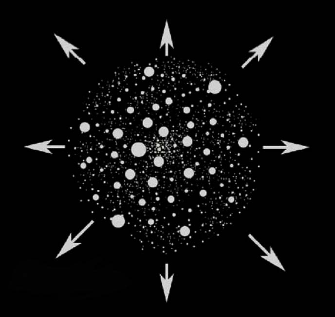

# (PART) প্যারাডক্স {-} 

এ অংশে আমরা অনেকগুলো প্যারাডক্স নিয়ে কথা বলবো। তবে তার আগে জেনে নিতে হবে প্যারাডক্স কাকে বলে। অভিধানের ভাষায় আপাত দৃষ্টিতে পরস্পর স্ববিরোধী ঘটনা বা বক্তব্যকে প্যারাডক্স বলে। সাধারণত এ ধরনের বিষয়গুলোকে প্রথম দৃষ্টিতে দেখে এক রকম মনে হয়, কিন্তু পরে দেখা যায় বিষয়টা আসলে অন্যরকম। আবার অনেক সময় উভয়-সংকটে পড়ে গেলে যে অবস্থার সৃষ্টি হয় তাকেও প্যারাডক্স বলে। আসলে প্যারাডক্সের সূচনা ঘটেছে এভাবেই। 

মনে করা হয়,এর সূচনা চীনে। চীন দেশে একবার এক লোক বল্লম ও ঢাল বিক্রি করছিল। সে দাবী করল,আমার কাছে এমন এক বল্লম আছে যা যে কোন কিছু ভেদ করতে পারে। সে আবার দাবী করল, আমার কাছে এমন এক ঢাল আছে যা যে কোন কিছু ঠেকিয়ে দিতে পারে। এ শুনে,এক চতুর কিশোর গিয়ে তাকে বলল,আমি যদি এই বল্লম দিয়ে এই ঢালে আঘাত করি,তাহলে কী হবে?
এ থেকেই 'জিজিয়াং মাওদুং' বা 'স্ব-বিরোধী' (Self-contradictory)পরিভাষাটির উদ্ভব।

আপাত দৃষ্টিতে অসম্ভব বলে মনে হয় অথচ সত্য- এমন ঘটনাও প্যারাডক্স।  

# একে একে শূন্য {#one-one-zero}

একবার শহর থেকে এক লোক গ্রামে ঘুরতে গেলেন। কিন্তু পথ হারিয়ে ফেলায় রাতে আর আসা হলো না। ওদিকে কোন আত্মীয়ও নেইযার বাসায় রাতটা কাটানো যায়। কারো বাড়িতে আশ্রয়ও পেলেন না। শেষে এক লোকতাকে এক পোড়া বাড়ির সন্ধান দিলো। ভূতে তার বিশ্বাস নেই। ভদ্রলোক সেখানেইরাতটা কাটিয়ে দিলেন। ভোরের দিকে ভূত এসে হাজির! যেন তেন ভূত নয়,ধবধবে সাদাকাপড় পরিহিত কঙ্কালসার এক ভূত। হাতে চিক চিক করছে ধারালো ছুরির ফলা। কাছে এসে সে ঘোষণা করল,আমার আস্তানায় এসেছো,মরতে হবে তোমাকে। লোকটা কাকুতি জানাল, “দেখ, আমি তোমার কোন পাকা ধানে মই দেইনি। আমার আর কোন উপায় ছিল না।”  

ভূত: হ্যাঁ, সুযোগ একটা তোমাকে দিতে পারি। দেখি তোমার গণিতে মাথা কেমন। আচ্ছা, বল দুইয়ে দুইয়ে কত? সময় দশ মিনিট। বলতে পারলে বেঁচে যাবে।

লোকটা মনে মনে ভীষণ খুশি। যাহ! বাঁচলাম। ভূতটার মাথায় তো গোবর ছাড়া কিছু নেই।

দশ মিনিট পর..

ভূত: হ্যাঁ,বল, দুইয়ে দুইয়ে কত?

লোকটি বলল: কত আর, চার।

ভূত: ইস! বাঁচতে আর পারলে না। দুইয়ে দুইয়ে হলো শুন্য। কে বলেছে তোমাকে যোগ করতে? একটু অপেক্ষা কর। ছুরিটায় একটু শান দিয়ে নিই।

লোকটাকে দেখিয়ে দেখিয়ে সে ছুরিতে শান দিতে থাকলো।

ততক্ষণে ভোরের আলো দেখা দিতে সে বলল, "ওহ হো, ভোর হয়ে গেল। বেঁচে গেলে। ভাগ্য ভালো তোমার।"

আসলে পুরোটাই ছিল রসিকতা। ভূতটা ছিল গাঁয়ের এক মহা রসিক লোক।

এবার আমি আরও সহজ একটি অঙ্ক দেই। বলুন তো, একে একে কত?

ভাবছেন, কোনটা বলে আবার বিপদে পড়ি। উত্তর হতে পারে ১, ২ বা ০। আচ্ছা, আমি কি বলে দিয়েছি দুইটা ১?

না, বরং মান বের করুন ১-১+১-১+১-১+১-...অসীম পর্যন্ত।

এর উত্তর বলা যদি পানির মত ভেবে থাকেন,তাহলে ভাবনা ঠিক আছে। কারণ,রসায়নের ভাষায় পানির গঠন 'সরল'কিছু নয়, বরং খুবই জটিল। তো এই সহজদর্শন ধারা পানির মতো জটিল কী করে হলো?

সামনে যাবার আগে একটা কাজ করুন। নিজের মতো করে এই ধারার যোগফল বের করুন।

এবার একত্রে করি,

প্রথমে চলুন, ধারাটিকে টেলিস্কোপ দিয়ে দেখি। মানে, কাটাকাটি দিয়ে ধারাটিকে ছোট করে নেই। যে ধারার উপর এমন ছুরি চালানো হয়, তাকেই বলে টেলিস্কোপিক ধারা। তাই আপনাকে টেলিস্কোপ কিনতে হচ্ছে না। বেঁচে গেলেন!

ধরি, ধারাটির সমষ্টি = S।

তাহলে, S = ১−১ + ১−১ + ১−১ + ১−১ + …

= (১−১) + (১−১) + (১−১) + … = ০ + ০ + ০ + …

= ০

তাহলে পেলাম ,একে একে শুন্য।

কিন্তু ভদ্রলোকের এক কথা- প্রবাদটা আমরা মানি না। এবার অন্যভাবে দেখি।

আমাদের আছে,  S = ১−১ + ১−১ + ১−১ + ১−১ + …

প্রথম ১ টিকে বাইরে নিয়ে এসে,

S = ১−১ + ১−১ + ১−১ + ১−১ + …

S = ১ + (−১ + ১) + (−১ + ১) + (−১ + ১) + …

= ১ + ০ + ০ + ০ + …

= ১

তাহলে, গুণ না করেও একে একে এক পাওয়া সম্ভব। যারা ভাবছেন, প্রথমে ১ টা ১ রেখে দিলে কাটাকাটি দেবার মত পর্যাপ্ত সংখ্যক এক কোথায় পেলাম, একটু ভাবুন, এখানে অসীমসংখ্যক ১ আছে। তাই, এর একটাকে বাইরে রাখলে কিছুই কমে না। কাটাকাটির জন্য আরও যথেষ্ট থাকে। আল্লাহর ভাণ্ডারও যেমন আর কি। কাউকে দান করলেও খালি হয় না।

আরেকভাবেচিন্তা কর, ধর, একটা হোটেলে অসীম সংখ্যক কক্ষ আছে। তাহলে যত লোকই রুমবুকিং দেয় না কেন, হোটেল কোন দিন খালি হবে না। এই হোটেল নিয়েও একটাপ্যারাডক্স আছে। ওটাকে আপাতত ফর্মালিন দিয়ে রাখলাম।

এই ধারায় ফলাফল ১পাওয়ার প্রক্রিয়াটির নাম হচ্ছে আইলেনবার্গ-মাজুর প্রতারণা (Eilenberg–Mazur swindle)। এই কৌশল দিয়ে দেখানোর চেষ্টা করা হয় ১ = ০।

প্রতারণাটা এ রকম,

১ = ১ + (−১ + ১) + (−১ + ১) + ... = ১−১ + ১−১ + ... = (১−১) + (১−১) + ... = ০

এবার, আরেকভাবে সমষ্টি বের করি।

S = ১−১ + ১−১ + ১−১ + ১−১ + …

সুতরাং, ১− S = ১− (১−১ + ১−১ + …) = ১−১ + ১−১ + … = S,

অর্থ্যাৎ, ১− S = S

∴  S + S = ১

∴ ২S = ১

বা S = ০.৫

এখানেইকিন্তু শেষ নয়। পূর্বোল্লিখিত টেলিস্কোপিক মেথড দিয়ে একটা ১ এর বদলে দুই, তিন...বা ইচ্ছামতো সংখ্যক এক-কে (১) বাইরে রেখে প্রমাণ করা যাবে যে সমষ্টি তত যেমন, ২,৩ ইত্যাদি, যা ইচ্ছে। তাহলে, সমস্যাটা কোথায়? 

আসলে ব্যাপার হচ্ছে, এখানে ধারাটিকে যোগ করার সময় আমরা একেবারেই ভুলে যাচ্ছি 'ধারা' বলতে কী বোঝায়। যারা এসএসসি পড়ছো বা শেষ করেছেন, তারা গণিত বইয়ে এমনধারা দেখে থাকবে। তবে, পার্থক্য আছে। সেখানে পদসংখ্যা অসীম ছিল না। বলা থাকতো, 2n+1 সংখ্যক পদের যোগফল কত ইত্যাদি। এমন শর্ত থাকলে কিন্তু ধারাটিতে আর কোন প্যারাডক্সের অস্তিত্ব থাকবে না।

যেমন, আমরা যদি ধারাটিকে 2n+1 তম পদ পর্যন্তবিবেচনা করি, তবে এর সমষ্টি হবে ১। কারণ, 2n+1 হচ্ছে বিজোড় সংখ্যার প্রতীক।আর আমাদের ধারার প্রত্যেক জোড়ার যোগফল শুন্য, বাড়তি থাকে আরেকটি এক।কিন্তু যদি জোড় সংখ্যক পদ যেমন 2n নেই, তবে প্রতি জোড়ার অঙ্কদ্বয় একে অপরকে শেষ করে দেয়। যোগফল হয় ১। 

কিন্তু, আমাদের আলোচ্য ধারায় পদের সংখ্যা নির্দিষ্ট নয়, বরং অসীম। আর, এ কারণেই দেখা যাচ্ছে একাধিক সমষ্টি। 
এই সিরিজের এমন অস্বাভাবিকতায় শেষ পর্যন্ত গণিত মহলে মত দাঁড়াল দুটো।

1. এই ধারার কোন সমষ্টি নেই।
2. এই ধারার সমষ্টি ০.৫।

একসময় এই ধারার এই দুই ফলাফল নিয়ে গণিতবিদদের মধ্যে তুমুল বিতর্ক হতো। ফলাফল '১' নিয়ে হতো না, কারণ যে যুক্তিতে এক হয় সেই যুক্তিতেই ২, ৩ ইত্যাদি যাচ্ছেতাই হতে পারে। তাই টেলিস্কোপিক মেথড বাদ। যুক্তি দাঁড়ালো সমষ্টিই নেই।

এখন, আমাদেরকে দেখতে হবে, আমরা আসলে কোন ধারার পদগুলোকে পুনর্বিন্যাস (Rearrangement) করতে পারি কিনা। হ্যাঁ, পারি বটে। তবে শর্ত মেনে। ধারাটিকে হতে হবে অভিসারী (Convergent)। কিন্তু আমাদের আলোচ্য ধারাটি অপসারী (Divergent)।

চলুন, সংক্ষেপে অপসারী ও অভিসারী ধারা সম্পর্কে জেনে নিই।

আগে নিচের দুটি ধারার দিকে তাকান। 

$\frac 1 2 + \frac 1 4 + \frac 1 8 + \frac 1 {16} + ...$ অসীম $\infty$ পর্যন্ত 

$\frac 1 2 + \frac 1 3 + \frac 1 5 + \frac 1 7 + \frac 1 {11} + ...$ অসীম পর্যন্ত 

প্রথম ধারাটি অসীম পর্যন্ত গেলেও আমরা যদি অসীমতম পদ বিবেচনা করি তবে, মান পাবো ০। কারণ, $\frac{1}{\infty}=\frac 1 {\frac{1}{0}}=1 \times \frac{1}{0}=0$। অর্থাৎ, এই ধারাটিতে অসীম পদ থাকলেও তাদের একটা সসীম লক্ষ্য আছে। এরা শূন্যের দিকে যাচ্ছে। আর, এর পদগুলোর মানও কিন্তু ধীরে ধীরে, একটা ধারাবাহিকতা বজায় রেখে কমছে। ঠিক যেন, অবতল দর্পণ থেকে প্রতিফলিত বা উত্তল দর্পণ থেকে প্রতিসরিত আলোর মতো। তাই, দর্পণ বা লেন্সের মতই একে অভিসারী ধারা বলা হয়। এ ধরণের ধারা পদকে পুনর্বিন্যাস করা যাব। অভিসারী ধারার তাই সমষ্টি বের করা সম্ভব। 

যেমন, এই ধারার যোগফল কিন্তু ১ যা একটি সসীম সংখ্যা। 
 

(\#fig:grandi)Guido Grandi

চিত্র: গুইদো গ্রান্দি এই ধারাটির প্রথম সরল বিবরণ দেন[^1]

এবার ২য় ধারাটির দিকে তাকাই। এটা হচ্ছে মৌলিক সংখ্যাগুলোর বিপরীত সংখ্যাগুলোর সমষ্টি। এতেও অসীম পদ আছে। কিন্তু অসীমতো অসীমই। এর মান কি নির্দিষ্ট কোন কিছুর দিকে যাচ্ছে? না। তাহলে এটি অপসারী। এর কোনো লক্ষ্যই নেই। পদগুলোর মধ্যে নেই কোন ধারাবাহিক মিল। তাই, এটি অপসারী ধারা। এর যোগফল কত? জিজ্ঞেস করলে কেউ কোনো নির্দিষ্ট সংখ্যা বলতে পারবে না। বলবে, ‘অসীম’। 

আমাদের আলোচ্য ধারাও গন্তব্যহীন। নেই কোনো বিশেষ লক্ষ্য। যেন মাঝ দরিয়ায় হাবুডুবু খাচ্ছে, এক বার মাথা পানির উপর ভেসে উঠছে, আবার পরক্ষণেই ডুবে যাচ্ছে। তাই, এর পদগুলোকে পুনর্বিন্যাস করলে ন্যায়বিচার করা হবে না। এ জন্যেই একটি মত হচ্ছে, এর কোন সমষ্টিই নেই। 

গণিতবিদ সিজারো এবং অ্যাবেল আধুনিক গণিতকাজে লাগিয়ে দেখিয়েছেন, এর সমষ্টি হয় ০.৫। এটাই সবচেয়ে প্রচলিত মত। তাদেরপ্রক্রিয়াটিও পানির মতই সহজ। তাই, আজ আর সেদিকে পা বাড়ালাম না। তবে, এই প্রক্রিয়ায় অভিসারী ধারার শর্ত ভঙ্গ করা হয় না।ধারাটিকে অসীম গুণোত্তর ধারা ধরে হিসেব করলেও ০.৫ ই আসে। তোমরা সেটা আমার চেয়ে ভালোই পারো। এক বার করে ফেলো, তাহলে।

[^1]: ইতালিয়ান গণিতবিদ গুইদো গ্রান্দি এই ধারাটির প্রথম সরল বিবরণ দেন বলে ধারাটিকে বলা হয় গ্রান্দির ধারা। 

# গ্রিক বীর গতিদানব অ্যাকিলিজ বনাম কচ্ছপ{#achilles-1}

গ্রীক দার্শনিক জেনো মনে করতেন গতি নিছকই একটি ভ্রম (Illusion)। মূলত তাঁর অগ্রজ দার্শনিক পারমিনাইডস প্রথম বাস্তবতার দুটি বিপরীত ধারণা তুলে ধরেন। জেনো সাহেব ঐ নীতির সমর্থনেই অনেকগুলো প্যারাডক্স তৈরি করেন। কারণ ভিন্নপন্থীরা পারমিনাইডসের মতবাদের বিরুদ্ধেও তাই করেছিলেন। 

জেনোর প্যারাডক্সসমূহের মধ্যে সবচেয়ে বিখ্যাত হলো "অ্যাকিলিজ ও কচ্ছপ প্যারাডক্স"। আড়াই হাজার বছর আগে জেনোর প্যারাডক্স নিয়ে লেখা বইয়ের এটাই সবচেয়ে সহজে বোঝা যায় যদিও ব্যাখ্যা করা সবচেয়ে দুঃসাধ্য। 

প্যারাডক্সটি যা বলতে চায় তা হলো-

ট্রোজান যুদ্ধের গতিমান বীর অ্যাকিলিজ  কচ্ছপের সাথে রেসে লেগেছেন। কচ্ছপ অ্যাকিলিজ একটু সামনে। গ্রীক বীর কচ্ছপের চেয়ে অবশ্যই দ্রুতগামী। একটু পেছন থেকে ধাওয়া করে তাকে কচ্ছপকে ওভারটেক করতে হবে। কাজটি সহজই মনে হয়। কিন্তু একটা সমস্যা দাঁড়াল। অতিক্রম করতে হলে আগে বীরকে কচ্ছপ পর্যন্ত পৌঁছতে হবে। অ্যাকিলিজ যতক্ষণে নিজের ও কচ্ছপের মধ্যকার আদি দূরত্ব পাড়ি দিয়েছেন ততক্ষণে কচ্ছপটি মাঝে আরেকটি গ্যাপ বানিয়ে ফেলেছে। নতুন গ্যাপটি আগের চেয়ে কম, কিন্তু প্রাণিটা ধরতে বীরকে সেই দূরত্ব পার হতে হবে। তিনি সেটা করলেনও। 

কিন্তু হায়! ততক্ষণে ছোট্ট এই জীবটি আরেকটি নতুন গ্যাপ তৈরি করে ফেলেছে। ফলাফল হল, োকগতগর কখোনোই কচ্ছপকে ধরতে পারবেন না যত দ্রুতই তিনি গ্যাপ ফিল-আপ করেন না কেন কারণ, কচ্ছপটা বরাবরই নতুন গ্যাপ বানাতে থাকবে। হ্যাঁ, সেগুলো আগেরগুলোর তুলনায় ক্ষুদ্রতর হবে বটে! 

জেনোর যুক্তিকে ভুল বলে উড়িয়ে দেওয়া বেশ লোভনীয়। তবে সাধারণত সেটা করা হয় অলসতা বা অস্বস্তি থেকে। অলসতা- কারণ এটা সমাধান না করেই আমরা সব সময় ভাবতে থাকি, এইতো সমাধান হয়ে গেছে। অস্বস্তির অনুভূতির কারণ হল এতো প্রাচীন এই দার্শনিকের কাছে যুক্তির মার খাওয়া। 

এই প্যারাডক্সের উত্তর দিতে গিয়ে অনেকেই বলেন যেহেতু অ্যাকিলিজ বেগ বেশি তাই তিনি কচ্ছপকে পার হয়ে যাবেন। কিন্তু জেনো তো ধরেই নিয়েছেন অ্যাকিলিজ বেগ বেশি। তাই এই বক্তব্য উত্তর হতে পারে না। বেগ বেশি বলেই তো গ্যাপ ক্রমাগত কমছে, কিন্তু কখোনোই জিরো হচ্ছে না। 

দর্শন ও গণিতের বেশির ভাগ প্রফেসরদের মতে শুধু এই প্যারাডক্সটি নিয়েই একটা বই লিখে ফেলা যেতে পারে। অনেকে লিখেছেনও। 

আসুন সংক্ষেপে প্যারাডক্সটি ভাঙ্গার চেষ্টা করি। 

জেনো প্রমাণ করতে চেয়েছিলেন পরিবর্তন ও গতি বাস্তব কিছু নয়। তাঁর অ্যারো প্যারাডক্সও সেই উদ্দেশ্যেই বানানো। ইলিনয়েস বিশ্ববিদ্যালয়ের অধ্যাপক নিক হাগেট বলেন জেনোর মত ছিলো, "গতিকে অস্বীকার করা পাগলামী তবে মেনে নেওয়া আরো কষ্টকর"।

জগৎ সম্পর্কে আমাদের ধারণা ও বাস্তবতার মধ্যে যে ফারাক প্যারাডক্সটি এটাই তুলে ধরে। Enlightening Symbols বইয়ের লেখক ও মার্লবোরো কলেজের গণিতের এমিরিটাস প্রফেসর জোসেফ মাজুরের মতে "প্যারাডক্সটি হচ্ছে এমন যা স্থান, কাল ও গতি সম্পর্কে আমাদেরকে ভুলভাবে চিন্তা করায়"। 

তাহলে আমাদের চিন্তার গলদ কোথায়?

গতি বাস্তব এবং সম্ভব, অবশ্যই। আর দ্রুতগামী দৌড়বিদ অবশ্যই কচ্ছপকে হারাবেন। সমস্যাটির সাথে আমাদের ইনফিনিটির (ম্যাগাজিন নয়, অসীমতা) ধারণার একটি যোগসূত্র আছে। 
অ্যাকিলিজ কাজ অসম্ভব মনে হয় কারণ তাকে সসীম সময়ে অসীম সংখ্যক কাজ (গ্যাপ পূরণ) করতে হবে। কিন্তু সব অসীমের প্রকৃতি এক নয়। 

ধারাদের মধ্যে অভিসারী (Convergent) ও অপসারী (Divergent) ধারা রয়েছে। স্পষ্টতম অপসারী ধারা হল ১+২+৩+... এই ধারার উত্তর অসীম। অ্যাকিলিজ কে এই ধারার ধরণের পথ পাড়ি দিতে হলে কাজটি অসম্ভব হয়ে যেত। অর্থ্যাৎ কচ্ছপ যদি ক্রমান্বয়ে বৃহত্তর দূরত্ব তৈরি করত তখন সেটা  অপসারী ধারা হত। 

এবার এই ধারাটির কথা ভাবুন

 $\frac 12 + \frac 14 + \frac 18 +\cdots$

 
 অসীম পর্যন্ত চললেও সিরিজটা অভিসারী যার উত্তর হয় ১। অসীম সংখ্যক পদের যোগফল যে সসীম সংখ্যা হতে পারে এই ধারাটা তার একটি প্রমান যা চমক ভাই কুমড়া থিওরি দিয়ে প্রমাণ করিয়েছিলেন। অ্যাকিলিজ  যদি দ্রুত দৌড়ে ক্রমান্বয়ে দূরত্ব কমান তাহলে যে ধারাটা তৈরি হয় তাও অনেকটা এই ধারাটার মত। ফলে, অ্যাকিলিজ  পরিমাপযোগ্য সসীম সময়ে অসীম ধারা সৃষ্টিকারী দূরত্ব পার হতে পারবেন। 

ধারার এই ধারণা জেনোর আরেকটি বিভ্রান্তিকর প্যারাডক্সের জবাব দেয়। সেটা হল দ্বিবিভাজন বা Dichotomy Paradox। মনে করুন, আপনার সামনে একটি বাস আছে যা আপনি দৌড় দিয়ে ধরতে চান। মনে করুন তার দূরত্ব $x$। $x$ দূরত্বে পৌঁছতে প্রথমে আপনাকে $\frac x2$ দূরত্বে যেতে হবে। $\frac x2$ দুরত্বে যেতে হলে আগে $\frac x4$, $\frac x8$ যেতে $\frac x8 \cdots$ ইত্যাদি। অর্থ্যাৎ সিকোয়েন্সটা দাঁড়ায় এমন -

$\{ \cdots , \frac1{16}, \frac18, \frac14, \frac12,1 \}$

অর্থ্যাৎ জেনোর মতে যেহেতু বাসটা ধরতে অসীম সংখ্যক পথ পাড়ি দিতে হবে সেহেতু বাস আর কোন দিনই ধরা হবে না। কিন্তু বেচারা জেনো! অসীম এই ধারা সমষ্টি সসীম। ফলে বাস ধরার স্বপ্নও অধরা থাকবে না। 

এ তো আমরা অসীমকে সসীম বানালাম। কিন্তু আরেকভাবে চিন্তা করলে আসলে সব সসীমই তো আসলে অসীম। যেমন ধরুন, পরীক্ষার সময় ১ ঘন্টা। এখন, চাইলে এই ঘন্টাকে অসীম সংখ্যক ভাগে বিভক্ত করা যায়। যে কোন রাশিকেই তো ক্ষুদ্রতর এককে হিসাব করতে থাকলে তা ইনফিনিটির দিকে যেতে থাকে। 

তবে, প্যারডক্সের রক্ষণভাগ এখোনও ধ্বসেনি। Halfway to Zero বইয়ের লেখক বেঞ্জামিন অ্যালেন এর মতে গাণিতিকভাবে এটা সম্ভব যে একটা দ্রুততর বস্তু একটি কম বেগসম্পন্ন বস্তুকে চিরকাল তাড়া করবে, কিন্তু ধরতে পারবে না, যদি সঠিক প্রক্রিয়ায় দুটোরই বেগ কমতে থাকে। 

এরও উত্তর মিলবে দুই ধরণের ধারার পার্থক্যের মধ্যে।  $\frac 12 + \frac 13 + \frac 14 + \frac 15 + \cdots$ ধারাটিকে কনভারজেন্ট মনে হলেও এটা আসলে ডাইভারজেন্ট (অপসারী -Divergent)। অ্যাকিলিজ  যদি এই ধারার মত করে কচ্ছপকে তাড়া করে বেড়ায় তবে সত্যি হার মানতে হবে। প্যারাডক্সে তেমন কোনো শর্ত নেই। তাই এবার প্যারাডক্স ঠিকই গোল খেল! 

তবে এই উত্তরে হয়তো গ্রিক দার্শনিকগণ সন্তুষ্ট হতেন না। কারণ  তাদের অনেকেই মনে করতেন চোখে দেখা বাস্তবতার চেয়ে তাদের যুক্তির ক্ষমতা বেশি।   

# অ্যাকিলিসের বিরুদ্ধে কচ্ছপের পাল্টা লড়াই{#achilles-2}

# পিঁপড়ার দড়াবাজি ও মহাবিশ্বের সম্প্রসারণ{#acrobat-ant}

আপনাদের নিশ্চয়ই একিলিস ও কচ্ছপের দৌড় প্রতিযোগিতার কথা মনে থাকার কথা, যেখানে কচ্ছপের অপকৌশল নস্যাৎ করে দিয়ে বীর একিলিস জিতে নিয়েছিল রেস। কাজটা যদিও প্র্যাকটিকেলি বড়ই সহজ ছিল, কিন্তু গণিতের অপপ্রয়োগ খাটিয়ে কচ্ছপ তাত্ত্বিকভাবে জিতে নিতে চেয়েছিল রেসটি।

এবারের লড়াইটিতে প্রাণী আছে একটিই। লড়াই করতে হবে একটি দড়ির সাথে। যে সে দড়ি নয়, সে এক রাবারের দড়ি। প্রতি মুহূর্তে এর দৈর্ঘ্য প্রসারিত হচ্ছে। এমনই এক দড়ির উপর দিয়ে পিঁপড়াটিকে পার হতে হবে।

খুলেই বলা যাক।  

শুরুতে দড়ির দৈর্ঘ্য ছিল ১ মিটার (৩ দশমিক ৩ ফুট)। পিঁপড়াটি এই রাবারের দড়িটির উপর দিয়ে প্রতি সেকেন্ডে ১ সেন্টিমিটার বেগে হেঁটে যাচ্ছে। দড়ি যদি স্বাভাবিক থাকতো, তাহলে ১ মিটার তথা ১০০ সেন্টিমিটার পথ পিঁপড়াটি ১০০ সেকেন্ডেই পার হয়ে যেত। তাহলে অবশ্য আর এই লেখাটি লেখা হতো না।

কিন্তু রাবারের দড়িটি প্রতি সেকেন্ডে ১ কিলোমিটার হারে প্রসারিত হয়ে যাচ্ছে। অনেকে চোখ কপালে তুলে ভাবছেন, এই দড়ি পিঁপড়াটি পার হবে কিভাবে? এও কি সম্ভব?

প্রাথমিকভাবে অবশ্য কাজটাকে অসম্ভবই মনে হবে। সহজ কারণ, চলার বেগের চেয়ে যদি পথের দৈর্ঘ্য বড় হয়ে যাবার বেগ বেশি হয় তাহলে আর কিইবা হতে পারে। কিন্তু, পিঁপড়ার পক্ষে কাজটি করা সম্ভব। তাতে কতো সময় লাগবে, তা আমরা পরে দেখবো। আগে দেখি, কিভাবে সম্ভব হবে।

চলা শুরুর পূর্ব মুহূর্তে পিঁপড়ার সামনে পুরো পথ তথা ১০০% দড়ি পড়ে আছে যা তাকে পার হতে হবে। ১ সেকেন্ড পরে দড়ির দৈর্ঘ্য ১ কিলোমিটার প্রসারিত হয়ে গেল। ওদিকে পিঁপড়াও কিন্তু চলেছে। ফলে, আগে যেখানে পথ বাকি ছিল ১০০%, এখন কিন্তু সেই ভগ্নাংশ আরো কমে গেছে।  ২য় সেকেন্ডে তার সামনে হিসাব থাকবে, ২ কিলোমিটার পথের মধ্যে ১৯৯৯ মিটার পাড়ি দিতে হবে। দেখুন ১০০% নয় কিন্তু। অবশ্য প্রকৃতপক্ষে আরেকটু কম পাড়ি দিতে হবে। কেন, বলছি একটু পরই। 

পরের সেকেন্ডে সে আরো ১ সেন্টিমিটার চলল। দড়িও প্রাসারিত হয়ে গেল আরো এক কিলোমিটার। কিন্তু খেয়াল করার বিষয় হলো দড়িটি শুধু পিঁপড়ার সামনের দিকে প্রসারিত হচ্ছে না, পেছনেও হচ্ছে। ব্যাপারটি যদি এমন হতো যে, দড়ির একেবারে শেষ প্রান্তে ১ কিলোমিটার করে নতুন দড়ি যুক্ত হচ্ছে, তাহলে কিন্তু ভগ্নাংশ মোটেই কমতো না। আজীবন চললেও কোনক্রমেই শেষ হতো না। 
কিন্তু এক্ষেত্রে পিঁপড়ার সামনে যেমন দড়ি বেড়ে যাচ্ছে, তেমনি বাড়ছে পেছনেও। ফলে, একই সাথে সামনে পড়ে থাকা দূরত্ব যেমন বাড়ছে, তেমনি বাড়ছে ফেলে আসা পথও। আর পিঁপড়া যতোই সামনে এগোচ্ছে, ততোই ফেলে আসা পথের ক্ষেত্রে প্রসারণ বাড়ছে এবং উল্টোভাবে কমে যাচ্ছে সামনে পড়ে থাকা পথের ভগ্নাংশ।

ফলে, এক সময় পিঁপড়াটি সত্যিই দড়িটি পার হয়ে যাবে। কিন্তু একটি শর্ত আছে। প্রাণিটিকে অবশ্যই অনেক অনেক... অনেক দীর্ঘায়ু পেতে হবে। কেননা, এই পথ পাড়ি দিতে তাকে  2.8 x 1043,429 সেকেন্ড পথ চলতে হবে। 
আপনি চাইলে ২৮ এর পর ৪৩৪২৮ টি শুন্য বসিয়ে দেখতে পারেন সংখ্যাটি কতো বড় হয়। সত্যি কথা হলো, মহাবিশ্বের বর্তমান বয়সও (প্রায় ১৪ বিলিয়ন বছর) কিন্তু এতো হয়নি।  

কিন্তু কাজটিকে কেন অসম্ভব মনে হয়?
এই কাজটিকে অসম্ভব মনে হবার দুটি কারণ থাকতে পারে।

১। দড়ি বড় হয়ে যাচ্ছে শুনে মনে হচ্ছে দড়ির শেষ প্রান্তে নতুন করে দড়ি যুক্ত হচ্ছে। বাস্তবে সম্পূর্ণ দড়িটিই প্রসারিত হচ্ছে, পিঁপড়ার সামনেও আবার পেছনেও।

২। পিঁপড়ার বেগ দড়ির প্রসারণ হারের তুলানায় নগণ্য বলে। আর এজন্যেই সময় অনেক বেশি লাগছে। এতই বেশি যে একে অসম্ভব মনে হয়ে যাচ্ছে।

 এ তো সম্পূর্ণ কাল্পনিক ভাবনা। এবার চলুন এ রকমই একটু বাস্তব উদাহরণ দেখি। আমরা জানি, আমাদের এই মহাবিশ্ব ক্রমাগত প্রসারিত হচ্ছে। যতোই প্রসারিত হচ্ছে ততোই প্রসারণের হারও বেড়ে যাচ্ছে। এর ফলাফলস্বরূপ আমরা দেখি গ্যালাক্সিরা পরস্পর থেকে দূরে সরে যাচ্ছে। দূরে সরার এই বেগ আলোর বেগকেও ছাড়িয়ে যাচ্ছে।
 
 আলোর বেগকেও ছাড়িয়ে যাচ্ছে- কথাটি বিস্ময়কর শোনালেও সত্যি। আলোর বেগই সর্বোচ্চ সম্ভাব্য বেগ- এই কথাটি প্রযোজ্য মহাবিশ্বের অভ্যন্তরীণ স্থান ও কালের জন্যে। অন্য দিকে, মহাবিশ্বের প্রসারণ আসলে এর নিজস্ব স্থান কালের প্রসারণ। স্থানের (Space) অভ্যন্তরস্থ কোন নিয়ম স্থান নিজে মানতে বাধ্য নয় বলেই এমনটি হচ্ছে।

আবার মূল প্রসঙ্গে আসি। কোনো গ্যালাক্সি যদি আমাদের থেকে আলোর চেয়েও বেশি বেগে দূরে সরে যায়, তাহলে ঐ গ্যালাক্সিকেকি আমরা দেখতে পাবো? প্রশ্নটা অনেকটাই পিঁপড়ার দড়াবাজির মতো যেখানে আমরা পিঁপড়ার জায়গায় আলো আর দড়ির জায়গায় প্রসারণশীল স্থানকে চিন্তা করতে পারি । আলো তার চেয়ে বেশি বেগে প্রসারিত হওয়া স্থান ভেদ করে আমাদের চোখে পৌঁছতে পারবে কিনা? একেও আগের মতোই অসম্ভব মনে হয়। 

একটু আগেই আমরা দেখলাম, অপেক্ষাকৃত বেশি বেগে প্রসারমান কোন বস্তুকেও অপেক্ষাকৃত কম বেগ নিয়েও পাড়ি দেওয়া যায়। কিন্তু আলোর ক্ষেত্রে একটু সমস্যা আছে। পিঁপড়ার ক্ষেত্রে রাবার প্রসারিত হচ্ছিল ধ্রুব বেগে। কিন্তু মহাবিশ্বের প্রসারণ হার ধ্রুব নয়, সময়ের সাথে সাথে বর্ধনশীল। ফলে যথেষ্ট দূরের গ্যালাক্সির আলো পৃথিবীতে নাও পৌঁছতে পারে।  কিন্তু স্বপতর দূরত্বের গ্যলাক্সির আলো পিঁপড়ার মতোই সফল হতে পারবে। 
