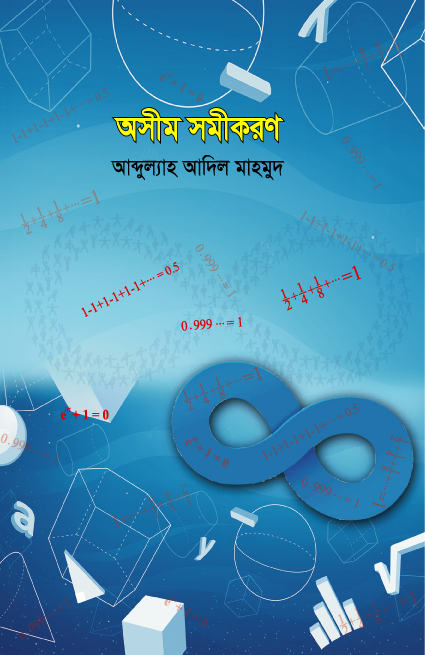

--- 
title: "অসীম সমীকরণ"
author: "আব্দুল্যাহ আদিল মাহমুদ"
date: "`r Sys.Date()`"
site: bookdown::bookdown_site
output: bookdown::gitbook
documentclass: book
bibliography: [book.bib, packages.bib]
biblio-style: apalike
link-citations: yes
github-repo: mahmudstat/l3m
description: "অসীম সমীকরণ"
---

# বই পরিচিতি {-}

```{r cover, echo=FALSE, fig.cap = "Book Cover", fig.align = 'center', out.width = '80%'}
knitr:: 
```

## প্রকাশনা 

*অসীম সমীকরণ* বইটি বইটি একুশে বইমেলা-২০১৯-এ তাম্রলিপি থেকে প্রকাশিত হয়। 

## বিষয়বস্তু 

আমাদের ব্রেইন খুব শক্তিশালী একটি জিনিস। আমরা যতটা অনুভব করি তার চেয়েও অনেক অনেক বেশি। বিশ্বের সেরা সেরা সুপারকম্পিউটারগুলো এখনও ব্রেইনের মতো সহজ করে জটিল কাজ করতে পারে না। কিন্তু তবুও ব্রেইনের কিছু দুর্বলতা আছে। তার মধ্যে একটি হলো কোনোকিছু দেখে ভুল অনুমান তৈরি। কাজটা অবশ্য ব্রেইন আমাদের সুবিধার জন্যেই করে। কিন্তু সুবিধা সবসময় হয় না। যেমন ধরুন ১-১+১-১+১-১+... ধারটি অসীম পর্যন্ত চললে যোগফল কতে হতে পারে? প্রথমে মনে হবে প্লাস আর মাইনাসে কাটাকাটি গিয়ে ০ থাকবে। উত্তরটি আসলে আংশিক সঠিক। কারণ, এই ধারার উত্তর হতে পারে নানান কিছু। এমনকি হতে পারে ০.৫ও। স্বাভাবিক বুদ্ধির বিপরীত এমন কিছু প্যারাডক্স নিয়ে বইটির মূল আলোচনা। রয়েছে গণিতের নান্দনিক কিছু বাস্তব প্রয়োগও। যেমন কীভাবে গণিত ও পরিসংখ্যান কাজে লাগিয়ে ঘুষখোর ধরা যায়। 

## লেখক পরিচিতি

**আব্দুল্যাহ আদিল মাহমুদ** 

```{r author, echo=FALSE, fig.cap = "Author", fig.align = 'center', out.width = '50%'}
knitr:: 
```

*পাবনা ক্যাডেট কলেজে* পরিসংখ্যান বিভাগের প্রভাষক হিসেবে কর্মরত। এর আগে রিসার্চ অ্যাসিস্ট্যান্ট হিসেবে কাজ করেছেন *ইঞ্জিনিয়ার্স অ্যান্ড অ্যাডভাইজরস লিমিটেড (EAL)* প্রতিষ্ঠানে।  ঢাকা বিশ্ববিদ্যালয়ের পরিসংখ্যান বিভাগ থেকে **অনার্স** ও **মাস্টার্স** ডিগ্রি অর্জন করেছেন। 

লেখালেখির সূচনা গণিত ম্যাগাজিন *পাই জিরো টু ইনফিনিটি*র মাধ্যমে। কন্ট্রিবিউটর হিসেবে কাজ করেছেন *প্রথম আলো* পরিবারের মাসিক বিজ্ঞান ম্যাগাজিন *বিজ্ঞানচিন্তা*য়। *কিশোরআলো*, *ব্যাপন*সহ বিভিন্ন ম্যাগাজিনে নিয়মিত লিখছেন গণিত, পরিসংখ্যান ও জ্যোতির্বিজ্ঞান নিয়ে। এছাড়া বিজ্ঞান বিষয়ে অনলাইনেও সক্রিয়ভাবে লেখালেখি করছেন। 

বাংলায় জ্যোতির্বিজ্ঞানকে জনপ্রিয়করণ ও সহজে উপস্থাপন করার জন্যে তৈরি করেছেন অনলাইন পোর্টাল [*বিশ্ব ডট কম*](https://sky.bishwo.com)।  একই উদ্দেশ্যে পরিসংখ্যান ও ডেটা সায়েন্স নিয়ে তৈরি করেছেন [*Stat Mania*](https://www.statmania.info)।

**প্রিয় শখ:** নতুন কিছু শেখা (বিশেষ করে গণিত ও জ্যোতির্বিজ্ঞান), প্রোগ্রামিং, ভ্রমণ ও রাতের আকাশ পর্যবেক্ষণ। 

**পৈত্রিক নিবাস:** লক্ষ্মীপুর সদর উপজেলার ঝাউডগী গ্রাম।

## লেখকের অনান্য বই

- *[অ্যা ব্রিফার হিস্ট্রি অব টাইম](https://www.rokomari.com/book/author/47631)* (২০১৭) (অনুবাদ, মূল স্টিফেক হকিং ও লিওনার্দ ম্লোডিনো)
- *[মহাবিশ্বের সীমানা](https://www.rokomari.com/book/author/47631)* (২০১৯) 
- *চন্দ্রজয়ের ৫০ বছর* (২০২০) (প্রথিতযশা কয়েকজন লেখকের সাথে যৌথভাবে) 
- *[লাস্ট থ্রি মিনিটস](https://l3m.bishwo.com)* (২০২১) 


**ইমেইল:** almahmud.sbi@gmail.com

**ওয়েবসাইট:** [mahmud.bishwo.com](https://mahmud.bishwo.com)

**ফেসবুক:** [mahmud.sbi](https://fb.com/mahmud.sbi)

## ভূমিকা

গণিত নিয়ে বই লিখেছি বলেই যে আমি গণিতে পাকা এমনটি ভাবার কোনো কারণ নেই। তবে আমি প্রতিনিয়ত শেখার চেষ্টা করি। শিখতে আমার ভাল লাগে। ২০১৪ সালের কথা। পরিসংখ্যানে অনার্স করতে গিয়ে গণিতের রাজ্যে ডুব দিতে হচ্ছে। কিন্তু গণিত নিয়ে খানিকটা ভীতি তখনও রয়ে গেছে। সেই সময় গণিত ম্যাগাজিন *পাই জিরো টু ইনফিনিটি* খুব ভালো চলছে। তত দিনে ব্লগ ও সোশ্যাল মিডিয়ায় টুকটাক লেখালেখি করতাম। ভাবলাম, গণিতভীতি দূর করতে হলে গণিত নিয়ে লিখতে হবে। যেই ভাবা সেই কাজ। পাইয়ের জানুয়ারি সংখ্যায় লিখলাম *কোন সংখ্যা কাকে দিয়ে বিভাজ্য*। এক থেকে এগারো সংখ্যাগুলোর বিভাজ্যতা নিয়ে। আমার প্রথম প্রকাশিত লেখা। একেবারেই সাধারণ একটি লেখা।

এরপর নিয়মিত লিখতে থাকলাম পাই ম্যাগাজিনে। কিছু দিন পর ব্যাপন ম্যাগাজিনে গাণিতিক প্যারাডক্স লিখতে শুরু করলাম। আস্তে আস্তে বুঝতে পারলাম গণিত ভীতি কমে যাচ্ছে। তখন বুঝলাম, কোনো বিষয় ভালো করে জানার একটি উপায় হলো সেটা নিয়ে লেখালেখি করা। লিখতে গেলেই বাধ্য হয়ে পড়তে হয়। আর পড়তে পড়তে বিষয়টি জানা হয়ে যায়। আরেকটি বিষয়ও বুঝলাম। কেউই লেখক হয়ে জন্মান না। পড়তে পড়তে আর লিখতে লিখতেই এক সময় লেখক হয়ে ওঠেন। তরুণ লেখক হিসেবে ভাবনাগুলো অনুপ্রেরণা দিত।

গণিত নিয়ে অনেকের মাঝে একটি ধারণা কাজ করে। সেটা হলো বাস্তব জীবনে গণিতের তেমন কোনো কাজ নেই। একটি জরিপ অনুসারে, ৭০% মানুষ মনে করেন বাস্তব জীবনে গণিতের কোনো ব্যবহার নেই। বন্ধুদের আড্ডায় আমরা নিজ নিজ পড়ার বিষয়কে শ্রেষ্ঠ প্রমাণ করতে সংগ্রামে নেমে পড়ি। কেউ বলেন, পদার্থবিদ্যাই মানব সভ্যতার ভিত্তি তৈরি করেছে। কারও মতে কাজটি করেছে রসায়ন। কেউ আবার কৃতিত্ব দেন চিকিৎসাবিদ্যাকে। এক্ষেত্রে গণিতকে কৃতিত্ব দেন খুব কম সংখ্যক মানুষ।

এটা সত্য গণিত আমাদের জীবনকে কীভাবে প্রভাবিত করে সেটা আমরা সরাসরি বুঝতে পারি না। আর তাই মানব সভ্যতার অগ্রগতির জন্যে আমরা বিজ্ঞানের অবদান অকপটে স্বীকার করলেও বিজ্ঞানের ভাষা গণিতের অবদান স্বীকার করতে চাই না। গণিতে নোবেল পুরষ্কারটি পর্যন্ত নেই। আমরা নিউটন, আইনস্টাইনকে বিজ্ঞানের অবদানের জন্য সম্মান দেই। কিন্ত ভুলে যাই, দুজনেই ছিলেন আবার তুখোড় গণিতবিদ। দুজনেই তত্ত্বের প্রতিষ্ঠার জন্যে আশ্রয় নিয়ছিলেন জটিল গণিতের।
আমরা প্রতিদিন জিপিএস ব্যবহার করি। কিন্তু কজন চিন্তা করি, জিপিস কাজ করত না যদি আপেক্ষিকতা তত্ত্বের পেছনের গণিতের হিসাবটা পাকা না হতো। ইন্টারনেট ব্রাউজ করি আমরা। অনলাইন পত্রিকার পাতায় দেখতে পাই পারসোনালাইজড আর্টিকেল বা বিজ্ঞাপন। কিন্তু কজন ভাবি, এর পেছনে কাজ করে পরিসংখ্যানের তত্ত্ব। কম্পিউটার ব্যবহার কে না করছি। অথচ কজন ভাবি এর ভেতরে কাজ করছে জটিল গাণিতিক অ্যালগোরিদম। আমরা মোবাইল অ্যাপ খুললেই জেনে ফেলতে পারি, আজ কবে সূর্যাস্ত হবে। চিন্তা করি না, সূর্য ডোবার আগেই সূর্যাস্তের সময় জানার কায়দাটা শিখিয়েছে গণিত। স্যাটেলাইট টিভিতে খবর আর খেলা দেখি। একবার ভাবি না, এই স্যাটেলাইট কক্ষপথে পৌঁছতে কত নিঁখুত গণিত মেনে চলতে হয়েছে।

কিন্ত প্রশ্ন দাঁড়ায়, মানলাম, গণিত খুব কাজে লাগে, কিন্তু তাই বলে সবাইকে গণিত জানতে হবে? অন্তত এটুকু বলব, সবাইকে গণিতের জটিল সব তত্ত্ব জানতে হবে এমন কোনো কথা নেই। কিন্ত গণিতের সাধারণ মারপ্যাঁচগুলো তো জানা চাই। যাতে আবার ভুল করে গণিতে অজ্ঞ রাজার মতো দাবার উদ্ভাবককে অসম্ভব পুরষ্কার দেবার প্রতিশ্রুতি দিয়ে না বসি। বা ছোট একটু সঠিক ধারণার অভাবে ভুল লোককে পুরষ্কার দিতে না হয়।

এখানে অনেকে আপত্তি করে বলবেন, গণিত তো অনেক জটিল আর বেরসিক জিনিস। এটা সম্ভবত পৃথিবীর ইতিহাসের সবচেয়ে বড় অপবাদ। গণিতে জটিলতার অভাব নেই এটা সত্য। তবে ধাপে ধাপে বুঝতে চেষ্টা করলে ব্যাপারগুলো আসলেই সহজ হয়ে আসে। আর রসিকতা? সেটায় গণিতের কাছেধারেই কেউ নেই। তবে সেটা বুঝতে হলে তো গণিতের রাজ্যে ভ্রমণ করা চাই।

 সতেরশো শতকে গ্যালিলিও বলে গেছেন: 

>আমাদের মহাবিশ্ব আসলে বিরাট এক গ্রন্থ। এর পরতে পরতে মিশে আছে দর্শন। গ্রন্থটা আমাদের চোখের সামনেই পড়ে আছে। কিন্তু একে বুঝতে হলে এর ভাষা আয়ত্ত করা চাই। সেই বর্ণগুলো চেনা চাই, যা দিয়ে লেখা হয়েছে এই বই। এটি লেখা হয়েছে গণিতের ভাষা দিয়ে, আর এর বর্ণমালা হল ত্রিভুজ, বৃত্ত ও অন্যান্য জ্যামিতিক চিত্রগুলো। এগুলো বাদ দিয়ে বইটির একটি শব্দও বোঝা সম্ভব নয়।
>
> --- II Saggiatore (1623)

তাহলে এই বই পড়লে কি মহাবিশ্বের ভাষাটা জানা হয়ে যাবে? নিশ্চয়ই, না। তবে গণিত যে বেরসিক না সেটার অনেকগুলো বাস্তব নমুনা পাওয়া যাবে। বেশ কিছু জায়গায় প্রথমে পড়ে অবিশ্বাস্য ঠেকবে। পরে দেখা যাবে মুদ্রোর উল্টো পিঠ। এ বিষয়গুলোকে ভালো না বেসে উপায় নেই। যেমন, ০.৯৯৯... এর মান বরাবর ১ (প্রায় ১ না হয়ে) বললে নিশ্চয়ই চোখে কপালে উঠে যাবে। কিন্তু বাস্তবতা এটাই।

বইটির মানোন্নয়নের ক্ষেত্রে ঢাকা বিশ্ববিদ্যালয়ের পরিসংখ্যান বিভাগের অধ্যাপক ড. জাফর আহমেদ খান স্যারের অবদান ভোলার নয়। এ বইয়ে প্রকাশিত অনেকগুলো বিষয়ই ক্লাসে বা ব্যক্তিগতভাবে স্যারের কাছে শেখা। স্যার নিজেও আবার সাহিত্যচর্চা করেন। সেই সুবাদে স্যারকে পাণ্ডুলিপিখানা একটু দেখে দেবার অনুরোধ করি। অধমের অনুরোধ রেখে অপরিসীম ব্যস্ততার মাঝেও স্যার বইটি এক নজরে দেখে দিয়েছেন। দিয়েছেন অনেকগুলো গুরুত্বপূর্ণ পরামর্শ। বইটি প্রকাশে বরাবরের মতোই আব্দুল গাফফার রনি ভাইয়ের অকৃত্রিম উৎসাহ পেয়েছি। আর বিজ্ঞান বই প্রকাশের ক্ষেত্রে তাম্রলিপির প্রকাশক এ কে এম তারিকুল ইসলাম রনি ভাইয়ের উৎসাহে সত্যিই মুগ্ধ হয়েছি। এ বইটি প্রকাশের ক্ষেত্রেও ভাইয়ের আগ্রহ ও একান্ত সহযোগিতার কথা ভুলবো না।

সবশেষে যা না বললেই নয়। লেখালেখির অন্যতম অনুষঙ্গ ভুল। সতর্ক থাকা সত্ত্বেও গণিত বইয়ে ভুল থাকা আবার একটু বেশিই সহজ। এই বইয়েও এমন কিছু ভুল থেকে যেতে পারে। এজন্যে আগেই ক্ষমা চেয়ে নিচ্ছি। বিজ্ঞ পাঠকের চোখে এমন কোনো ভুল চোখে পড়লে আমাকে ইমেইলে জানালে কৃতজ্ঞ থাকব। পাশাপাশি বইটির [ওয়েবসাইটে](https://github.com/mahmudstat/os/issues/new) ভুলগুলো রিপোর্ট করা যাবে। ওয়েবসাইটের ‘সংশোধনী’ পাতায় ভুলগুলো সংশোধনী প্রকাশ করা হবে ইনশাআল্লাহ। 

আব্দুল্যাহ আদিল মাহমুদ

মতিঝিল, ঢাকা 

## বই কিনতে

সারা দেশের বিক্রয়কেন্দ্রগুলোতে পাওয়া যাবে বইটি। পাওয়া যাবে [রকমারি ডট কমেও](https://www.rokomari.com/book/author/47631)। 